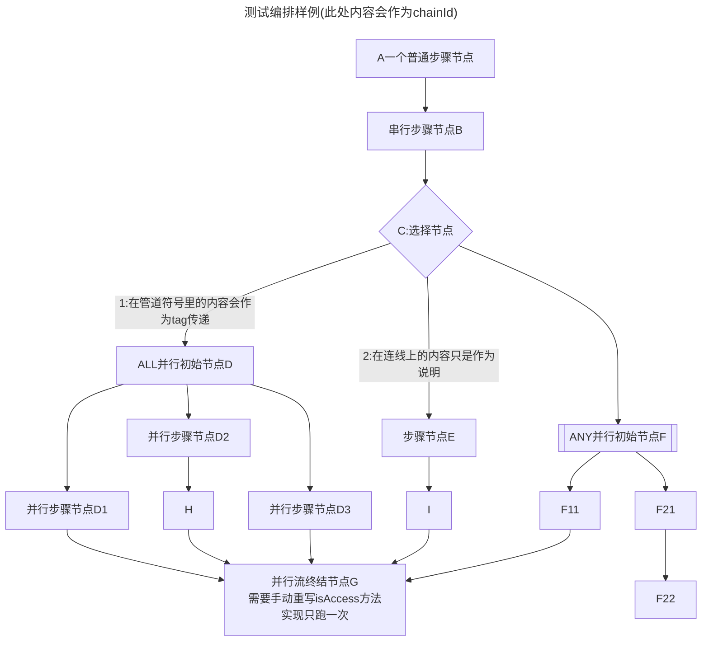

# 使用
1. 在resources下放你的编排用.md文件
2. 在配置文件里指定 liteflow.rule-source-ext-data=classpath:/CASE3.md;
3. 引入
```xml
<dependency>
    <groupId>com.yomahub</groupId>
    <artifactId>liteflow-rule-markdown</artifactId>
    <version>2.9.6</version>
</dependency>
```
# .md文件注意事项
1. 使用 mermaid version 9.3.0+ 语法
3. 一个.md文件一套流程
4. 只解析文件里的第一个“```mermaid”块，后面的图只作为对第一个主流程的补充说明给用户自己参考用
5. 详情参照头图《测试编排样例》


## UPGRADE mermaid version in idea markdown plugin (Windows)

1. execute command
```cmd
npm i mermaid
```
2. find latest mermaid.js under .\node_modules\mermaid\dist

3. replace mermaid.js in
C:\Users\{your user name}\AppData\Local\JetBrains\IdeaIC2022.3\markdown\download\mermaidlanguageextension\mermaid

