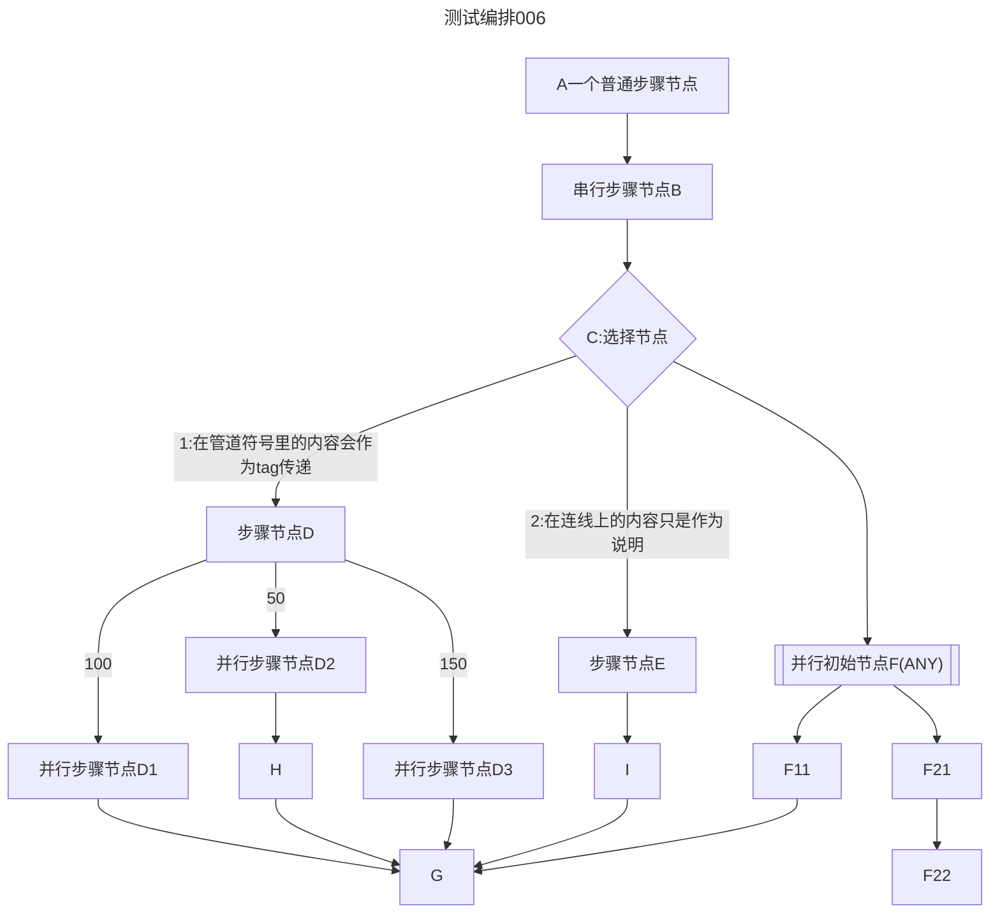

```mermaid
--- 
title: 测试编排006
---
flowchart TD;
A[A一个普通步骤节点] --> B[串行步骤节点B] --> C{C:选择节点}
C --> |1:在管道符号里的内容会作为tag传递| D[步骤节点D] -->|100| D1[并行步骤节点D1] --> G
D[步骤节点D] -->|50| D2[并行步骤节点D2] --> H --> G
D[步骤节点D] -->|150| D3[并行步骤节点D3] --> G 
C --2:在连线上的内容只是作为说明--> E[步骤节点E] --> I --> G
C --> F[["并行初始节点F(ANY)"]] --> F11 --> G
F[["并行初始节点F(ANY)"]] --> F21 --> F22 

```
