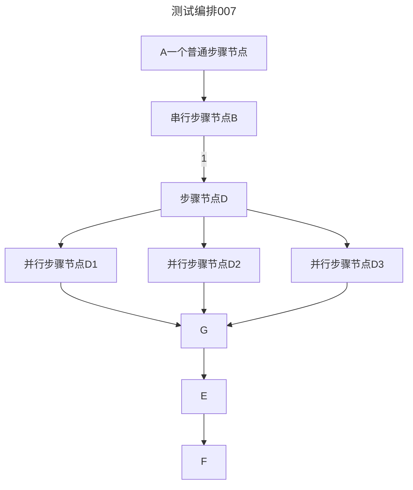

```mermaid
--- 
title: 测试编排007
---
flowchart TD;

A[A一个普通步骤节点] --> B[串行步骤节点B] 
B --> |1| D[步骤节点D] --> D1[并行步骤节点D1] --> G
D[步骤节点D] --> D2[并行步骤节点D2]  --> G
D[步骤节点D] --> D3[并行步骤节点D3] --> G
G --> E 
E --> F
```
